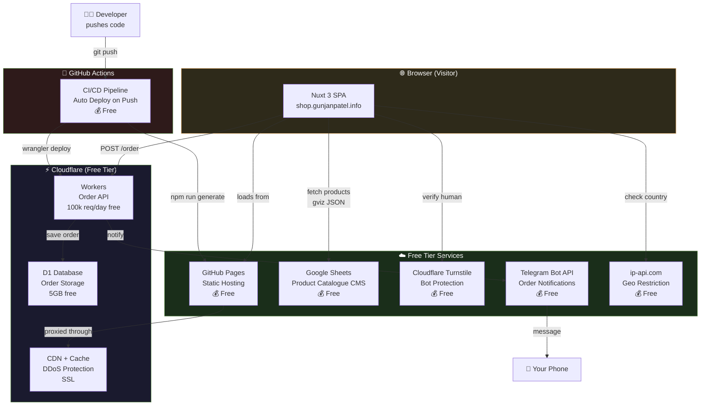

# Architecture Diagram

```mermaid
graph TB
    subgraph Client["🌐 Browser (Visitor)"]
        UI["Nuxt 3 SPA\nshop.gunjanpatel.info"]
    end

    subgraph Free["☁️ Free Tier Services"]
        GH["GitHub Pages\nStatic Hosting\n💰 Free"]
        GS["Google Sheets\nProduct Catalogue CMS\n💰 Free"]
        TS["Cloudflare Turnstile\nBot Protection\n💰 Free"]
        TG["Telegram Bot API\nOrder Notifications\n💰 Free"]
        IP["ip-api.com\nGeo Restriction\n💰 Free"]
    end

    subgraph CF["⚡ Cloudflare (Free Tier)"]
        CDN["CDN + Cache\nDDoS Protection\nSSL"]
        W["Workers\nOrder API\n100k req/day free"]
        D1["D1 Database\nOrder Storage\n5GB free"]
    end

    subgraph GHA["🔄 GitHub Actions"]
        CI["CI/CD Pipeline\nAuto Deploy on Push\n💰 Free"]
    end

    Dev["👨‍💻 Developer\npushes code"] -->|"git push"| CI
    CI -->|"npm run generate"| GH
    CI -->|"wrangler deploy"| W

    UI -->|"loads from"| GH
    GH -->|"proxied through"| CDN
    UI -->|"fetch products\ngviz JSON"| GS
    UI -->|"verify human"| TS
    UI -->|"check country"| IP
    UI -->|"POST /order"| W
    W -->|"save order"| D1
    W -->|"notify"| TG
    TG -->|"message"| Phone["📱 Your Phone"]

    style Free fill:#1a2e1a,stroke:#4B7C38,color:#fff
    style CF fill:#1a1a2e,stroke:#4B7C38,color:#fff
    style GHA fill:#2e1a1a,stroke:#4B7C38,color:#fff
    style Client fill:#2e2a1a,stroke:#D4A15C,color:#fff
```
